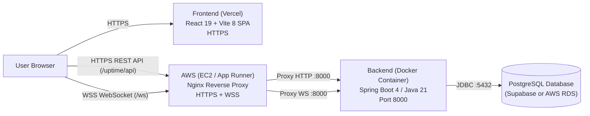

# UpTime App - Complete Deployment Guide

This guide walks you through deploying the **Frontend to Vercel** and the **Backend to AWS**, along with connecting your PostgreSQL database and configuring real-time WebSockets.

---

## Architecture Overview



---

## Part 1: Frontend Deployment to Vercel

### 1. Project Configuration (Already Prepared)
- `frontend/vercel.json` has been created with SPA route rewrites to avoid 404s on page refresh:
  ```json
  {
    "rewrites": [{ "source": "/(.*)", "destination": "/index.html" }]
  }
  ```
- All API and WebSocket calls now read from environment variables with fallback:
  - `VITE_API_BASE_URL` (default: `http://localhost:8000/uptime/api`)
  - `VITE_WS_URL` (default: `http://localhost:8000/ws`)

### 2. Deploy Steps on Vercel Dashboard
1. Go to [vercel.com](https://vercel.com) and log in.
2. Click **"Add New..."** -> **"Project"**.
3. Import your GitHub repository: `UpTime-Maintenance-Log-Reporting-App`.
4. In the **Configure Project** screen:
   - **Framework Preset**: Vite
   - **Root Directory**: Click `Edit` and select `frontend` (Important!)
   - **Build Command**: `npm run build` (default)
   - **Output Directory**: `dist` (default)
5. *(Optional)* Expand the **Environment Variables** section if your AWS backend is already deployed:
   | Key | Example Value | Description |
   |---|---|---|
   | `VITE_API_BASE_URL` | `https://api.yourdomain.com/uptime/api` | Your deployed AWS backend API URL |
   | `VITE_WS_URL` | `https://api.yourdomain.com/ws` | Your deployed AWS WebSocket URL |
6. Click **Deploy**. Vercel will build and assign you a live URL (e.g., `https://uptime-maintenance.vercel.app`).

> [!NOTE]
> Environment variables are optional on Vercel during initial launch. The frontend builds and runs immediately without them, and you can add your backend URL in Vercel settings later anytime!

---

## Part 2: Database Setup (PostgreSQL)

You have two simple options for your PostgreSQL database:

### Option 1: Supabase (Recommended - Free & Fast)
Your `.env` already has Supabase credentials configured. Supabase provides a free, managed cloud PostgreSQL database with SSL enabled by default.
- Connection String format:
  ```
  jdbc:postgresql://<project-ref>.supabase.co:5432/postgres?sslmode=require
  ```
- Username: `postgres.<project-ref>`
- Password: `<your-supabase-password>`

### Option 2: AWS RDS PostgreSQL (Free Tier Eligible)
1. Go to AWS RDS Console -> **Create Database**.
2. Engine: **PostgreSQL** (version 16).
3. Template: **Free Tier**.
4. DB instance identifier: `uptime-postgres`.
5. Master username: `postgres`, Master password: `<secure_password>`.
6. Instance configuration: `db.t3.micro` or `db.t4g.micro`.
7. Connectivity: **Publicly accessible = Yes** (or place backend EC2 in the same VPC/Security Group).
8. Security Group: Allow inbound traffic on port `5432` from your EC2 instance security group.

---

## Part 3: Backend Deployment to AWS

### Method A: AWS EC2 with Docker & Nginx SSL (Recommended for Free Tier & WebSockets)

This method qualifies for AWS 12-Month Free Tier (`t2.micro` or `t3.micro`), natively supports WebSockets/SockJS, and provides free SSL using Certbot.

#### 1. Launch EC2 Instance
1. In AWS Console -> **EC2** -> **Launch Instance**.
2. OS: **Ubuntu 24.04 LTS (HVM)** (64-bit x86).
3. Instance Type: `t2.micro` or `t3.micro` (Free tier eligible).
4. Key pair: Create or select an existing `.pem` key.
5. Security Group rules (Inbound):
   - **SSH (22)**: My IP (or 0.0.0.0/0)
   - **HTTP (80)**: 0.0.0.0/0
   - **HTTPS (443)**: 0.0.0.0/0
   - **Custom TCP (8000)**: 0.0.0.0/0 (optional for direct testing)
6. Click **Launch Instance**.

#### 2. Connect & Install Docker on EC2
SSH into your instance:
```bash
ssh -i "your-key.pem" ubuntu@<ec2-public-ip>
```
Install Docker & Docker Compose:
```bash
sudo apt update && sudo apt upgrade -y
sudo apt install -y docker.io docker-compose-v2 git nginx certbot python3-certbot-nginx
sudo usermod -aG docker ubuntu
newgrp docker
```

#### 3. Clone Repository & Start Application
```bash
git clone https://github.com/Mangalasridharan/UpTime-Maintenance-Log-Reporting-App.git
cd UpTime-Maintenance-Log-Reporting-App
```
Create your `.env` file in the root directory:
```bash
cat << 'EOF' > .env
PORT=8000
SPRING_DATASOURCE_URL=jdbc:postgresql://<db-host>:5432/<db-name>
DB_USER=<db-username>
DB_PASSWORD=<db-password>
JWT_SECRET=VGhpc0lzQVN1cGVyU2VjcmV0S2V5Rm9ySldUU3ByaW5nQm9vdA==
JWT_EXPIRATION=1800000
ADMIN_EMPLOYEE_NAME=mangal
ADMIN_EMPLOYEE_PASSWORD=mangal@123
EOF
```
Build and start the container:
```bash
docker compose up -d --build
```
Verify the backend is running:
```bash
curl http://localhost:8000/health
# Response: {"status":"UP","service":"uptime-maintenance-backend",...}
```

#### 4. Configure Nginx with Free SSL (HTTPS & WebSocket)
1. Point a domain or free dynamic DNS (such as [DuckDNS.org](https://www.duckdns.org/)) to your EC2 Public IP (e.g. `uptime-api.duckdns.org`).
2. Create Nginx site configuration:
```bash
sudo nano /etc/nginx/sites-available/uptime
```
Paste this configuration:
```nginx
server {
    server_name uptime-api.duckdns.org; # Replace with your domain

    location / {
        proxy_pass http://localhost:8000;
        proxy_http_version 1.1;

        # WebSocket support
        proxy_set_header Upgrade $http_upgrade;
        proxy_set_header Connection "upgrade";

        proxy_set_header Host $host;
        proxy_set_header X-Real-IP $remote_addr;
        proxy_set_header X-Forwarded-For $proxy_add_x_forwarded_for;
        proxy_set_header X-Forwarded-Proto $scheme;
    }
}
```
Enable the site:
```bash
sudo ln -s /etc/nginx/sites-available/uptime /etc/nginx/sites-enabled/
sudo rm -f /etc/nginx/sites-enabled/default
sudo nginx -t
sudo systemctl reload nginx
```
3. Issue a free SSL Certificate with Certbot:
```bash
sudo certbot --nginx -d uptime-api.duckdns.org
```
Your backend is now live with full HTTPS and WSS at: `https://uptime-api.duckdns.org`!

---

### Method B: AWS App Runner (PaaS Container Deployment)

If you don't want to manage an EC2 server, AWS App Runner provides automatic HTTPS and scaling.

1. Build & Push Docker image to AWS ECR:
   ```bash
   aws ecr create-repository --repository-name uptime-backend
   aws ecr get-login-password --region <region> | docker login --username AWS --password-stdin <aws-account-id>.dkr.ecr.<region>.amazonaws.com
   docker tag uptime-backend:latest <aws-account-id>.dkr.ecr.<region>.amazonaws.com/uptime-backend:latest
   docker push <aws-account-id>.dkr.ecr.<region>.amazonaws.com/uptime-backend:latest
   ```
2. In AWS App Runner Console -> **Create Service**.
3. Source: **Container registry** -> Select your ECR image.
4. Port: `8000`.
5. Environment Variables:
   - `SPRING_DATASOURCE_URL`
   - `SPRING_DATASOURCE_USERNAME`
   - `SPRING_DATASOURCE_PASSWORD`
   - `JWT_SECRET`
   - `JWT_EXPIRATION`
6. Health Check: Path `/health`, Protocol `HTTP`, Port `8000`.
7. Deploy. App Runner generates a default HTTPS URL (e.g. `https://xxxx.awsapprunner.com`).

---

## Part 4: Connecting Vercel Frontend to AWS Backend

Once your backend is running at your AWS HTTPS URL (e.g. `https://uptime-api.duckdns.org` or `https://xxxx.awsapprunner.com`):

1. Go to your **Vercel Project Settings** -> **Environment Variables**.
2. Add or update:
   - `VITE_API_BASE_URL` = `https://<your-backend-domain>/uptime/api`
   - `VITE_WS_URL` = `https://<your-backend-domain>/ws`
3. Click **Save** and trigger a **Redeploy** on Vercel.
4. Open your Vercel app URL in the browser and test logging in and real-time updates!
