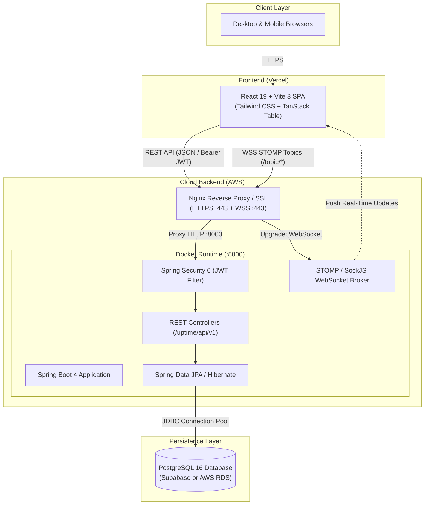

# ⚡ UpTime - Industrial Maintenance & Log Reporting Platform

[](https://adoptium.net/)
[](https://spring.io/projects/spring-boot)
[](https://react.dev/)
[](https://vitejs.dev/)
[](https://www.postgresql.org/)
[](https://www.docker.com/)
[](https://aws.amazon.com/)
[](https://vercel.com/)

**UpTime** is an enterprise industrial maintenance operating system designed for modern manufacturing plants. It eliminates paper logs, accelerates incident response times, and provides real-time telemetric visibility into factory floor machines, breakdown complaints, and maintenance technician dispatches.

---

## 📑 Table of Contents
- [Key Features](#-key-features)
- [System Architecture](#-system-architecture)
- [Tech Stack](#-tech-stack)
- [Repository Structure](#-repository-structure)
- [Quick Start (Local Development)](#-quick-start-local-development)
  - [Option A: One-Command Docker Compose](#option-a-one-command-docker-compose-recommended)
  - [Option B: Running Manually](#option-b-running-manually)
- [Configuration & Environment Variables](#-configuration--environment-variables)
- [API Overview](#-api-overview)
- [Production Deployment](#-production-deployment)
- [License](#-license)

---

## 🚀 Key Features

- **🏭 Real-Time Machine Telemetry & Fleet Tracking**
  - Instant monitoring of equipment health statuses (`RUNNING`, `IDLE`, `UNDER_MAINTENANCE`).
  - Live broadcast updates to all connected dashboards via STOMP WebSockets without page refreshes.
- **🚨 Breakdown & Complaint Management Lifecycle**
  - Instant incident logging with priority tagging, breakdown descriptions, and photo attachments.
  - Automated state progression from `PENDING` $\rightarrow$ `ASSIGNED` $\rightarrow$ `IN_PROGRESS` $\rightarrow$ `RESOLVED`.
- **👷 Worker & Technician Smart Assignment**
  - Filter technicians by specialized engineering departments (Electrical, Mechanical, PLM, Dyeing, Finishing, Printing).
  - Workload balance indicators and task distribution.
- **🔔 Live Notification & Alert Center**
  - Real-time toast alerts and dedicated notification drawer powered by Spring Event listeners and WebSocket topics.
  - Unread/Read filtering, search, and full-screen notification mode.
- **📊 Interactive High-Performance Data Tables**
  - Powered by `@tanstack/react-table` with multi-column sorting, search filters, and custom pagination.
  - Switchable Grid/Table views with state preservation.
- **✨ Interactive Demo Mode**
  - Zero-login interactive simulator allowing prospective clients or recruiters to test machine and complaint workflows with mock live streams.
- **🔒 Enterprise Security**
  - Stateless JWT authentication, BCrypt salted password hashing, and role-based access control (Admin, Worker, Employee).

---

## 🏛 System Architecture



---

## 💻 Tech Stack

### Backend
- **Language & Runtime:** Java 21 (Eclipse Temurin LTS)
- **Framework:** Spring Boot 4.0.6
- **Security:** Spring Security 6, JJWT 0.12.6, BCrypt
- **Persistence:** Spring Data JPA, Hibernate ORM, PostgreSQL Driver
- **Real-Time Communication:** Spring WebSocket, STOMP, SockJS
- **Configuration & Utilities:** Lombok, Spring DotEnv, Spring Validation

### Frontend
- **Framework:** React 19.2
- **Build Tool:** Vite 8.0
- **Routing:** React Router v7
- **State & Tables:** TanStack Table v8, React Hooks
- **Icons & UI:** Lucide React, Custom Responsive CSS
- **Networking & Sockets:** Axios, `@stomp/stompjs`, `sockjs-client`

### DevOps & Infrastructure
- **Containers:** Docker, Docker Compose (Multi-stage build with Alpine JRE)
- **Cloud Hosting:** AWS (EC2 / App Runner) & Vercel
- **Database:** PostgreSQL (Supabase Cloud or AWS RDS)
- **Reverse Proxy & SSL:** Nginx, Certbot (Let's Encrypt)

---

## 📁 Repository Structure

```text
UpTime-Maintenance-Log-Reporting-App/
├── backend/
│   ├── src/main/java/com/msd/uptime/backend/
│   │   ├── configurations/       # Spring Security, CORS & WebSocket config
│   │   ├── controllers/          # REST controllers (Machines, Complaints, Employees, Health)
│   │   ├── DTO/                  # Request & Response Data Transfer Objects
│   │   ├── events/ & listeners/  # Application-level notification event bus
│   │   ├── filters/              # JWT authentication filter
│   │   ├── models/               # JPA entity definitions (Machine, Complaint, Employee, etc.)
│   │   ├── repositories/         # Spring Data JPA repositories
│   │   └── services/             # Business logic & dashboard implementations
│   ├── src/main/resources/       # application.properties
│   ├── Dockerfile                # Production multi-stage Docker build
│   ├── .dockerignore             # Docker build exclusions
│   ├── .env.example              # Backend environment template
│   └── pom.xml                   # Maven dependencies
├── frontend/
│   ├── src/
│   │   ├── api/                  # Axios HTTP client with JWT interceptor
│   │   ├── component/            # Navigation, Layout, ThemeToggle, Notifications
│   │   ├── config/               # Dynamic API & WebSocket URL resolution
│   │   ├── pages/                # Landing, Demo, Login, Register, Dashboards
│   │   ├── App.jsx               # Route definitions
│   │   └── main.jsx              # Entry point
│   ├── package.json              # Frontend dependencies and build scripts
│   ├── vite.config.js            # Vite build configuration
│   ├── vercel.json               # Vercel SPA routing configuration
│   └── .env.example              # Frontend environment template
├── docker-compose.yml            # Local & EC2 full-stack orchestration
└── DEPLOYMENT_GUIDE.md           # AWS & Vercel production deployment walkthrough
```

---

## ⚡ Quick Start (Local Development)

### Prerequisites
- [Java 21 JDK](https://adoptium.net/) & [Maven](https://maven.apache.org/) (or use included `mvnw`)
- [Node.js 20+](https://nodejs.org/) & [npm](https://www.npmjs.com/)
- [Docker & Docker Compose](https://www.docker.com/) (optional, for containerized run)
- [PostgreSQL](https://www.postgresql.org/) (if running without Docker)

---

### Option A: One-Command Docker Compose (Recommended)

This spins up PostgreSQL and the Spring Boot Backend in linked containers:

```bash
# Clone the repository
git clone https://github.com/Mangalasridharan/UpTime-Maintenance-Log-Reporting-App.git
cd UpTime-Maintenance-Log-Reporting-App

# Start Backend + PostgreSQL
docker compose up -d --build

# In a separate terminal, start Frontend
cd frontend
npm install
npm run dev
```
Open **http://localhost:5173** in your browser!

---

### Option B: Running Manually

#### 1. Setup Backend
1. Ensure your PostgreSQL server is running and create the database:
   ```sql
   CREATE DATABASE "Uptime-Maintenance-log-reporting-app";
   ```
2. Navigate to `backend/` and configure your `.env` (or copy from `.env.example`):
   ```bash
   cd backend
   cp .env.example .env
   ```
3. Run the Spring Boot application:
   ```bash
   # On Windows:
   .\mvnw.cmd spring-boot:run

   # On Linux/macOS:
   ./mvnw spring-boot:run
   ```
   Backend will start at **http://localhost:8000**. Verify with:
   ```bash
   curl http://localhost:8000/health
   # Response: {"status":"UP","service":"uptime-maintenance-backend"}
   ```

#### 2. Setup Frontend
1. Navigate to `frontend/`:
   ```bash
   cd ../frontend
   npm install
   ```
2. Start the Vite development server:
   ```bash
   npm run dev
   ```
3. Open **http://localhost:5173**.

---

## ⚙️ Configuration & Environment Variables

### Backend (`backend/.env`)

| Variable | Default Value | Description |
|---|---|---|
| `PORT` | `8000` | Server listening port |
| `SPRING_DATASOURCE_URL` | `jdbc:postgresql://localhost:5432/...` | Full JDBC database connection string |
| `DB_USER` | `postgres` | Database username |
| `DB_PASSWORD` | `mangal@123` | Database password |
| `JWT_SECRET` | `VGhpc0lz...` | Base64-encoded secret key for signing JWTs |
| `JWT_EXPIRATION` | `1800000` | Token expiration time in milliseconds (30 min) |
| `ADMIN_EMPLOYEE_NAME` | `mangal` | Default system administrator account |
| `ADMIN_EMPLOYEE_PASSWORD` | `mangal@123` | Default system administrator password |

### Frontend (`frontend/.env`)

| Variable | Default Value | Description |
|---|---|---|
| `VITE_API_BASE_URL` | `http://localhost:8000/uptime/api` | Base URL for REST API endpoints |
| `VITE_WS_URL` | `http://localhost:8000/ws` | Base URL for SockJS / STOMP WebSockets |

---

## 📡 API Overview

### Health & Monitoring
| Method | Endpoint | Access | Description |
|---|---|---|---|
| `GET` | `/health` or `/` | Public | System status and health check |

### Authentication
| Method | Endpoint | Access | Description |
|---|---|---|---|
| `POST` | `/uptime/api/v1/employee/auth/register` | Public | Register new employee |
| `POST` | `/uptime/api/v1/employee/auth/login` | Public | Authenticate employee & get JWT |

### Machines
| Method | Endpoint | Access | Description |
|---|---|---|---|
| `GET` | `/uptime/api/v1/machines` | Authenticated | List all machines |
| `POST` | `/uptime/api/v1/machines` | Authenticated | Register a new machine |
| `GET` | `/uptime/api/v1/machines/{id}` | Authenticated | Get machine details & history |
| `PUT` | `/uptime/api/v1/machines/{id}/status` | Authenticated | Update machine status |

### Complaints
| Method | Endpoint | Access | Description |
|---|---|---|---|
| `GET` | `/uptime/api/v1/complaints` | Authenticated | List all active complaints |
| `POST` | `/uptime/api/v1/complaints` | Authenticated | File a new machine complaint |
| `PUT` | `/uptime/api/v1/complaints/{id}/assign` | Authenticated | Assign technician to complaint |

### Real-Time WebSocket Topics
- `/topic/machinelist` - Broadcasts real-time machine status changes
- `/topic/dashboard` - Broadcasts live dashboard statistics
- `/topic/complaints` - Broadcasts newly logged or updated complaints

---

## 🌐 Production Deployment

For comprehensive, step-by-step instructions with diagrams and commands, consult the **[DEPLOYMENT_GUIDE.md](DEPLOYMENT_GUIDE.md)**:

- **Frontend on Vercel**: Connect the repository, set **Root Directory** to `frontend`, leave framework preset as **Vite**, and deploy.
- **Backend on AWS**:
  - **AWS EC2 (Free Tier)**: Ubuntu 24.04 with Docker, Docker Compose, and Nginx reverse proxy with Certbot SSL.
  - **AWS App Runner**: Serverless container deployment with automated HTTPS and scaling.
- **PostgreSQL**: Cloud managed via **Supabase** (free tier with SSL) or **AWS RDS PostgreSQL**.

---

## 📄 License
This project is open-source and available under the [MIT License](LICENSE).
